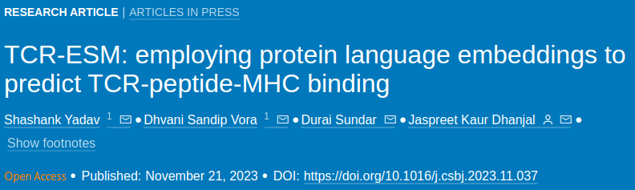

# TCR-ESM: employing protein language embeddings to predict TCR-peptide-MHC binding

## Description

This is the GitHub repository for the project **TCR-ESM: employing protein language embeddings to predict TCR-peptide-MHC
binding** by Shashank Yadav, Dhvani Sandip Vora, Durai Sundar, Jaspreet Kaur Dhanjal

## Getting Started

### Dependencies / Requirements
* numpy==1.23.5
* pandas==1.5.3
* tqdm==4.66.1
* natsort==8.4.0
* matplotlib==3.7.1
* tensorflow==2.14.0
* torch==2.1.1
* fair-esm==2.0.0
* scikit-learn==1.2.2

## Repository directories & files
+ [`0_ESM_Embeddings_Extractor.ipynb`](0_ESM_Embeddings_Extractor.ipynb) contains code for extraction of embeddings from the ESM1v model using the fair-esm library.  
+ [`1_netTCRdata_trainESMmodel_BP_MIRA.ipynb`](1_netTCRdata_trainESMmodel_BP_MIRA.ipynb) contains code for model training on NetTCR 2.0 (CDR3beta+peptide) data and evaluation on the MIRA dataset.
+ [`2_netTCRdata_trainESMmodel_ABP.ipynb`](2_netTCRdata_trainESMmodel_ABP.ipynb) contains code for model training on NetTCR 2.0 data, cross validation evaluation and peptide based metrics.
  + Models:
    + CDR3alpha+CDR3beta+peptide
    + CDR3beta+peptide
    + CDR3alpha+peptide  
+ [`3_MCPAS_trainESMmodel.ipynb`](3_MCPAS_trainESMmodel.ipynb) contains code for model training on McPAS dataset data.
  + Models for McPAS Subset 1 data (without MHC information)
    + CDR3alpha+CDR3beta+peptide
    + CDR3beta+peptide
    + CDR3alpha+peptide 
  + Models for McPAS Subset 2 data (with Human MHC information)
    + CDR3alpha+CDR3beta+peptide+MHC
    + CDR3beta+peptide+MHC
    + CDR3alpha+peptide+MHC  
    + CDR3alpha+CDR3beta+peptide
    + CDR3beta+peptide
    + CDR3alpha+peptide  
  + Also, includes cross validation evaluation, test set evalution, peptide and mhc based metrics.
+ [`4_VDJDB_trainESMmodel.ipynb`](4_VDJDB_trainESMmodel.ipynb) contains code for model training on VDJDb dataset data.
    + Models for VDJDb Subset 1 data (without MHC information)
    + CDR3alpha+CDR3beta+peptide
    + CDR3beta+peptide
    + CDR3alpha+peptide 
  + Models for VDJDb Subset 2 data (with Human MHC information)
    + CDR3alpha+CDR3beta+peptide+MHC
    + CDR3beta+peptide+MHC
    + CDR3alpha+peptide+MHC  
    + CDR3alpha+CDR3beta+peptide
    + CDR3beta+peptide
    + CDR3alpha+peptide   
  + Also, includes cross validation evaluation, test set evalution, peptide and mhc based metrics.
+ [`5_Embeddings_analysis_netTCR_data_ESMmodel_ABP.ipynb`](5_Embeddings_analysis_netTCR_data_ESMmodel_ABP.ipynb) contains code for analysis of learned embeddings in the input and intermediate layers of the model trained on NetTCR2.0 dataset.
+ [`6_Embeddings_analysis_MCPAS_ESMmodel.ipynb`](6_Embeddings_analysis_MCPAS_ESMmodel.ipynb) contains code for analysis of learned embeddings in the input and intermediate layers of the model trained on McPAS dataset.
+ [`7_Embeddings_analysis_VDJDB_ESMmodel.ipynb`](7_Embeddings_analysis_VDJDB_ESMmodel.ipynb) contains code for analysis of learned embeddings in the input and intermediate layers of the model trained on VDJDb dataset.
+ [`8_MCPAS_VDJDB_ext_validation.ipynb`](8_MCPAS_VDJDB_ext_validation.ipynb) contains code for external evaluation of models (CDR3beta,peptide) trained on McPAS / VDJDb dataset and evaluated on pmtNet dataset with different similarity thresolds (90% and 80%).

### Note: Using ESM1v to generate embeddings of 100 randomly generated peptides using ESM1v takes approximately 17 seconds, model training time may vary from 3 minutes to 3 hours, and predictions involve a quick forward pass lasting up to 3 seconds. These computations were performed on a GPU with 16 GB VRAM, demonstrating the computational efficiency of TCR-ESM. This highlights the feasibility of implementing TCR-ESM for scanning numerous peptides swiftly, aligning to facilitate cognate target identification for T-cell receptors in the context of T-cell therapy development.

### We have compared our approach to three models from the literature. 
* For the netTCR 2.0 model, please visit [NetTCR 2.0](https://github.com/mnielLab/NetTCR-2.0)
* For the ERGO II (AE and LSTM), please visit [ERGO-II](https://github.com/IdoSpringer/ERGO-II)

## Authors
### Contributors names and contact info
+ [@Shashank Yadav](https://github.com/xinformatics)
+ [@Dhvani Vora](https://github.com/d-vora)
+ [@Durai Sundar](https://github.com/TeamSundar)
+ [@Jaspreet Kaur Dhanjal](https://github.com/dhanjal-lab)

